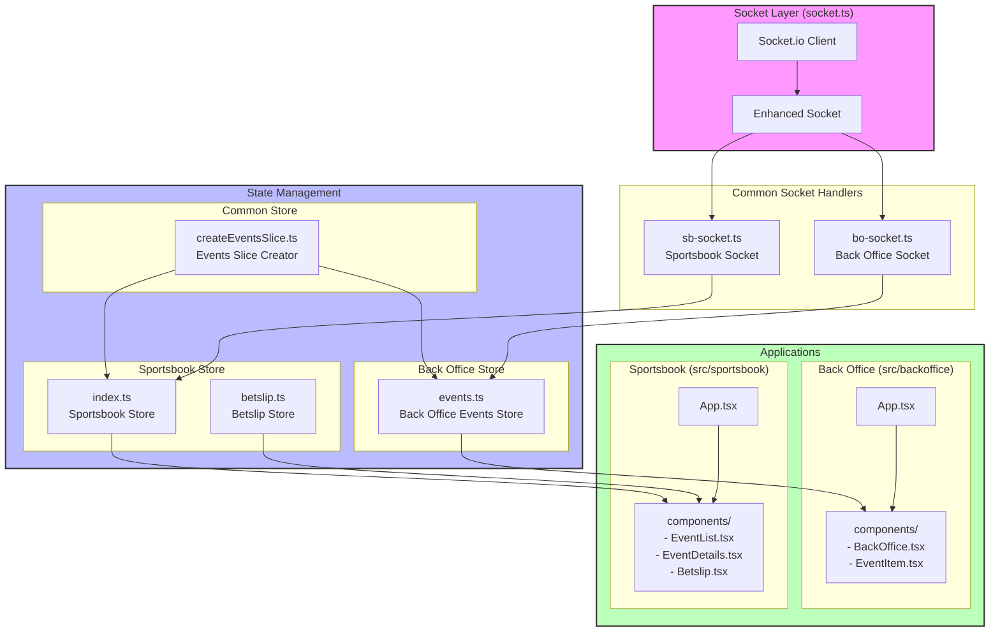

# Application Architecture

## System Overview

## Data Flow

1. Socket Layer
   - `socket.ts`: Establishes WebSocket connection
   - Enhanced Socket wrapper provides type-safe event handling

2. Common Socket Handlers
   - `bo-socket.ts`: Manages Back Office specific socket events
   - `sb-socket.ts`: Manages Sportsbook specific socket events

3. State Management
   - Common Store
     - `createEventsSlice.ts`: Reusable events state logic
   - Back Office Store
     - `events.ts`: Manages event data and UI state
   - Sportsbook Store
     - `index.ts`: Combines events and betslip state
     - `betslip.ts`: Manages betting selections and stakes

4. Applications
   - Back Office
     - Single page application for odds management
     - Real-time event suspension and price updates
   - Sportsbook
     - Multi-page application with routing
     - Event list, details, and betslip functionality

## Key Features

- Real-time updates using WebSocket
- Shared state management logic
- Separate concerns between Back Office and Sportsbook
- Persistent betslip state
- Price change animations
- Event suspension handling