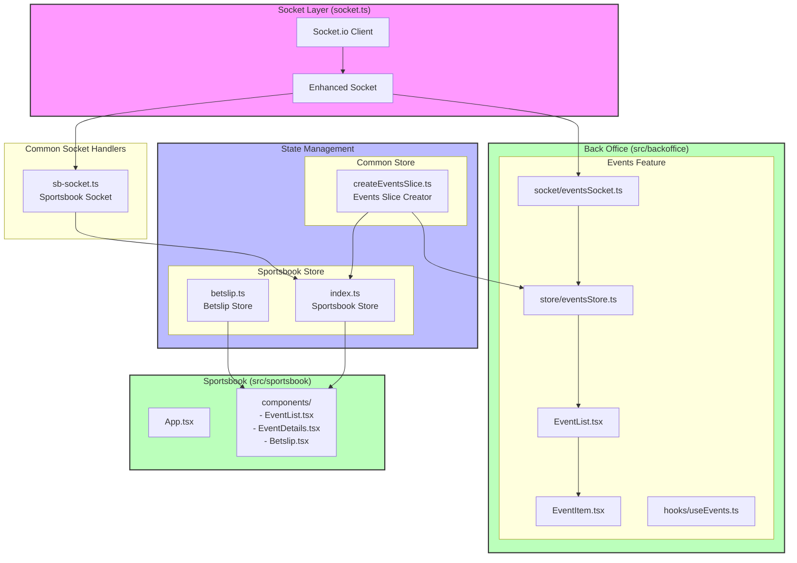

# Application Architecture

## System Overview

## Data Flow

1. Socket Layer
   - `socket.ts`: Establishes WebSocket connection
   - Enhanced Socket wrapper provides type-safe event handling

2. Back Office Application
   - Events Feature (`src/backoffice/events/`)
     - `EventList.tsx`: Main events management interface
     - `EventItem.tsx`: Individual event row with price controls
     - `hooks/useEvents.ts`: Data fetching logic
     - `socket/eventsSocket.ts`: Event-specific socket handlers
     - `store/eventsStore.ts`: Events state management

3. Common Socket Handlers
   - `sb-socket.ts`: Manages Sportsbook specific socket events

4. State Management
   - Common Store
     - `createEventsSlice.ts`: Reusable events state logic
   - Sportsbook Store
     - `index.ts`: Combines events and betslip state
     - `betslip.ts`: Manages betting selections and stakes

5. Sportsbook Application
   - Multi-page application with routing
   - Event list, details, and betslip functionality

## Key Features

- Real-time updates using WebSocket
- Shared state management logic
- Screaming architecture organization
  - Features organized by domain/purpose
  - Clear separation of concerns
  - Cohesive feature modules
- Price change animations
- Event suspension handling
- Persistent betslip state

## Back Office Architecture Details

The Back Office follows a screaming architecture pattern, organizing code by feature rather than technical type:

1. Events Feature Module (`/events`)
   - Complete ownership of events management
   - Self-contained with its own:
     - Components (EventList, EventItem)
     - Hooks (useEvents)
     - Store (eventsStore)
     - Socket handlers (eventsSocket)

2. State Management
   - Uses Zustand for state
   - Extends common events slice
   - Manages:
     - Event data
     - Price updates
     - Suspension states
     - UI states (loading, updating)

3. Real-time Updates
   - Debounced price updates
   - Immediate UI feedback
   - Websocket communication
   - Visual indicators for changes

4. Data Flow
   - Initial load via HTTP
   - Real-time updates via WebSocket
   - Bidirectional communication for:
     - Price changes
     - Event suspension