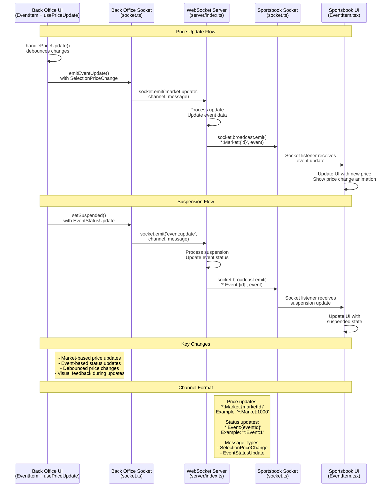

```mermaid
sequenceDiagram
    participant BO as Back Office UI<br/>(EventItem + usePriceUpdate)
    participant BS as Back Office Socket<br/>(socket.ts)
    participant Server as WebSocket Server<br/>(server/index.ts)
    participant SS as Sportsbook Socket<br/>(socket.ts)
    participant SB as Sportsbook UI<br/>(EventItem.tsx)

    Note over BO,SB: Price Update Flow
    BO->>BO: handlePriceUpdate()<br/>debounces changes
    BO->>BS: emitEventUpdate()<br/>with SelectionPriceChange
    BS->>Server: socket.emit('market:update',<br/>channel, message)
    Server->>Server: Process update<br/>Update event data
    Server->>SS: socket.broadcast.emit(<br/>'*:Market:{id}', event)
    SS->>SB: Socket listener receives<br/>event update
    SB->>SB: Update UI with new price<br/>Show price change animation

    Note over BO,SB: Suspension Flow
    BO->>BS: setSuspended()<br/>with EventStatusUpdate
    BS->>Server: socket.emit('event:update',<br/>channel, message)
    Server->>Server: Process suspension<br/>Update event status
    Server->>SS: socket.broadcast.emit(<br/>'*:Event:{id}', event)
    SS->>SB: Socket listener receives<br/>suspension update
    SB->>SB: Update UI with<br/>suspended state

    Note over BO,SB: Key Changes
    Note right of BO: - Market-based price updates<br/>- Event-based status updates<br/>- Debounced price changes<br/>- Visual feedback during updates

    Note over BO,SB: Channel Format
    Note right of Server: Price updates:<br/>'*:Market:{marketId}'<br/>Example: '*:Market:1000'<br/><br/>Status updates:<br/>'*:Event:{eventId}'<br/>Example: '*:Event:1'<br/><br/>Message Types:<br/>- SelectionPriceChange<br/>- EventStatusUpdate
```